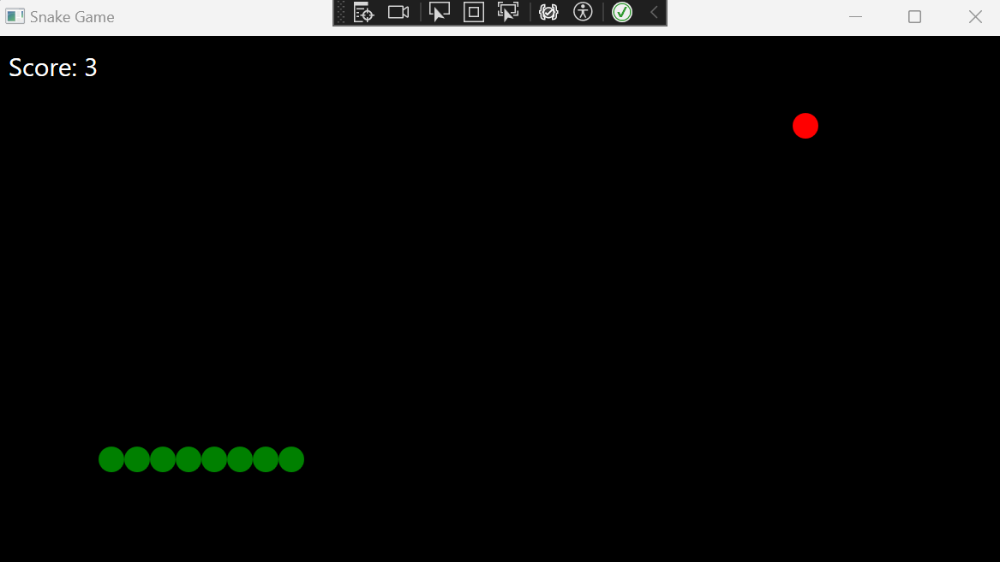

# WPF Snake Game

This is a classic Snake game implemented in C# using WPF (Windows Presentation Foundation).

## Screenshot

## How to Play

- Use the arrow keys to control the snake's direction.
- Eat the red food to grow longer and increase your score.
- Avoid hitting the walls or yourself.

## Features

- Smooth snake movement
- Score tracking
- Game over dialog
- Restart functionality

## Building and Running

1. Open the solution in Visual Studio.
2. Build the project.
3. Run the executable.

## Controls

- **Up Arrow:** Move snake up
- **Down Arrow:** Move snake down
- **Left Arrow:** Move snake left
- **Right Arrow:** Move snake right